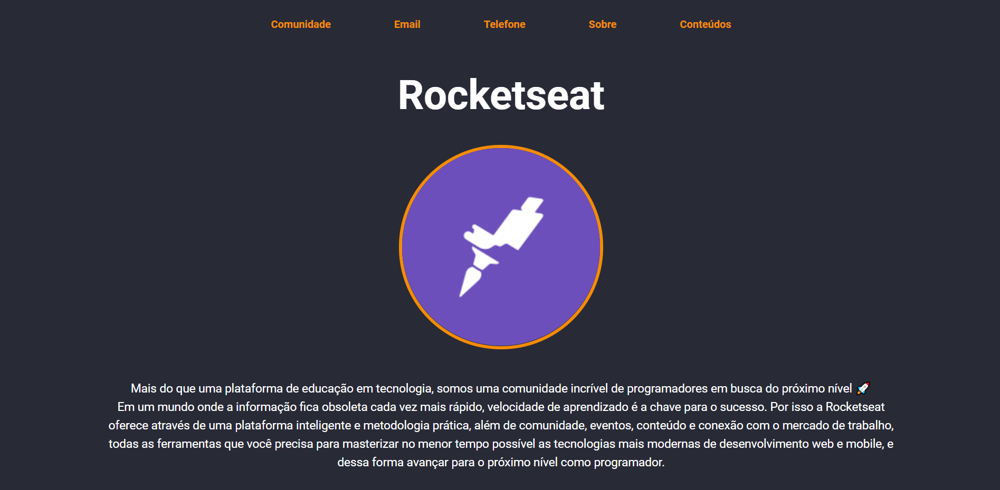
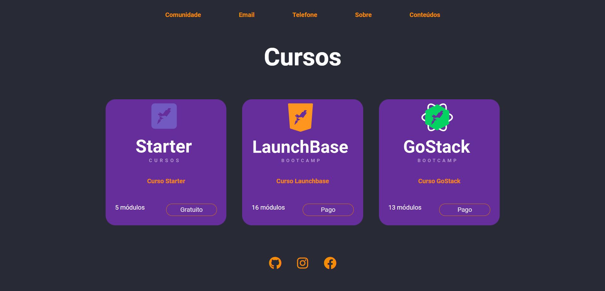

<h1 align="center">
    RocketSeat Webpage
</h1>

<h1>

</h1>

<h1>

</h1>

<h1>

</h1>

# 📋 About

A project that I developed during Launchbase bootcamp from Rocketseat

---

# 💻 Features 

This project was developed with:
- [HTML](https://developer.mozilla.org/en-US/docs/Web/HTML)
- [CSS](https://developer.mozilla.org/en-US/docs/Web/CSS)
- [JavaScript](https://developer.mozilla.org/en-US/docs/Learn/Getting_started_with_the_web/JavaScript_basics)

---

# 📂 Getting started
```bash

# Clone this repository using
$ git clone https://github.com/jpautran/

```
---

<h3 align="center">
Created by João Paulo Autran 🚀
</h3>            